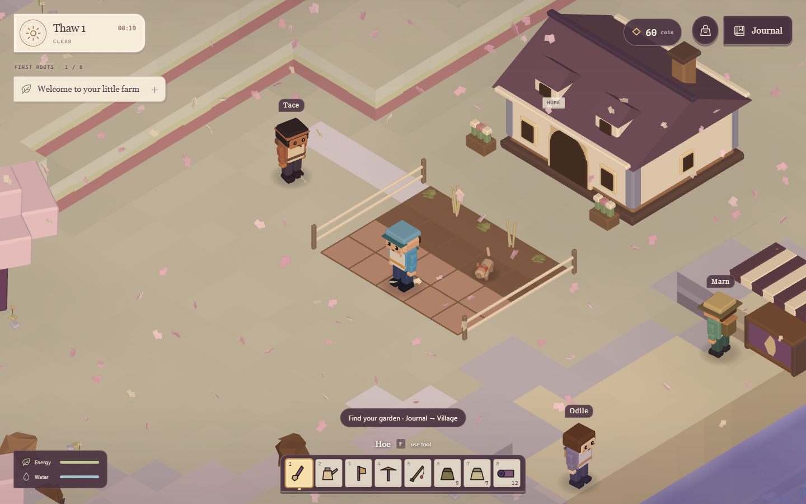
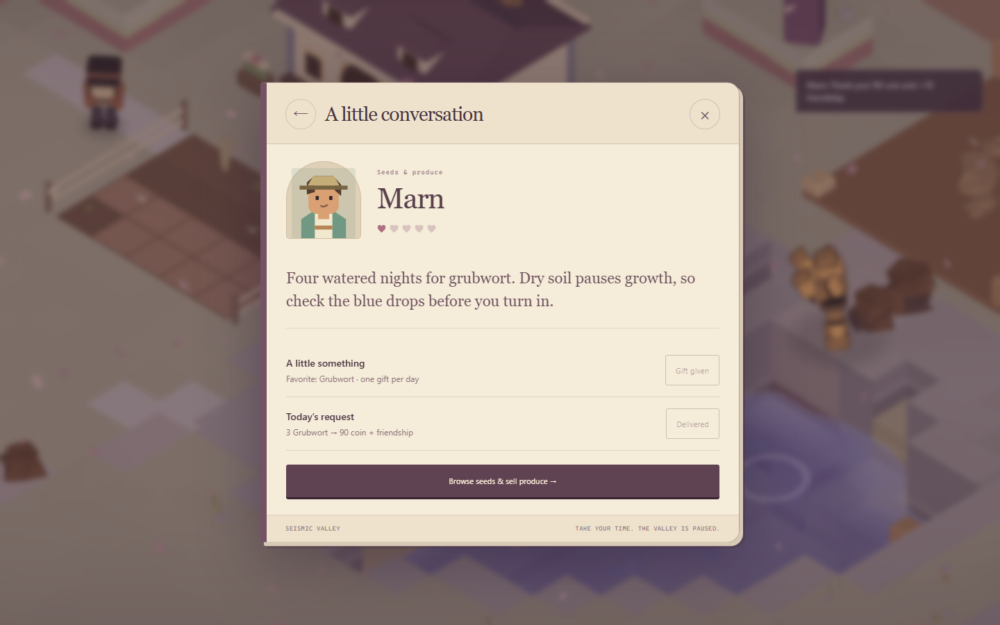
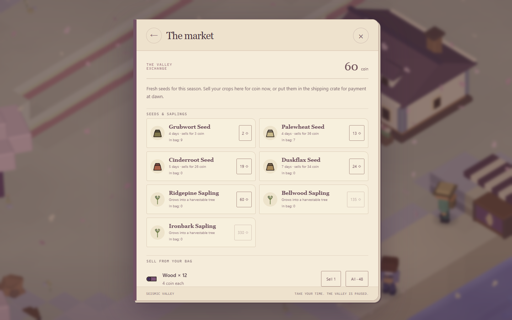
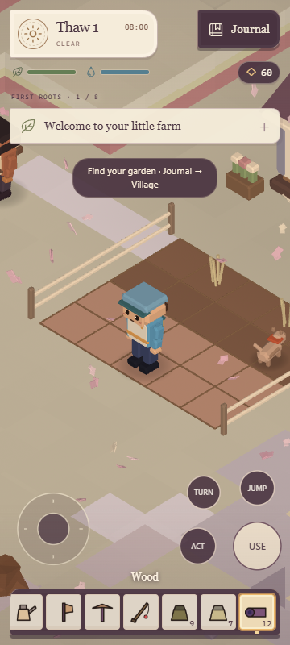

# Seismic Valley

**A patch of earth. A place to call home.**

[Play the game](https://seismic-valley.vercel.app/) · [Made by Nxrskyaa](https://x.com/nxrskyaa)

An isometric farming game inspired by Seismic’s visual identity. Grow a garden,
sell your harvest, get to know the neighbors and turn a field cabin into a home.
The world, characters, crops and music are generated in code with Three.js.



## Your first harvest

1. Find the fenced garden outside your house. Use the hoe on an empty square.
2. Equip a seed, plant it, and water it with the can. Blue dots mark watered soil.
3. Water the starter row too: those plants need just one more watered night.
4. Open **Journal → Home** and sleep. Crops grow overnight and your watering can refills.
5. Harvest a ready crop with **E**. A gold marker means it is ready.
6. Sell at **Market** for coin immediately, or use the shipping crate for payment
   the next morning. Every harvest also returns a seed.

Twelve crop species grow across four seasons. The market stocks seeds that can
be planted in the current season. Dry nights pause growth; rain waters the field.
Fishing, trees, mining and the old colony restoration systems remain available.

## The neighbors

- **Marn**, the seed merchant, buys produce and sells seeds and saplings.
- **Tace**, the carpenter, helps you plan your house and restore the neighborhood.
- **Odile**, the pond keeper, introduces fishing while your crops grow.

Walk near a neighbor and press **E**. Daily chats, favorite gifts and deliveries
build friendship. Each reward can be earned once per neighbor per day; this
limit survives saving and reloading. **Journal → Village → Find** gives a direction and distance.



## A home to grow into

Your house has four visible stages: field cabin, farmhouse, garden house and
valley homestead. The first upgrade costs **30 wood, 18 stone and 250 coin**.
The Home panel shows both what you need and what you already have.

Rebuild ruined cottages to open more farmland. Restore the kiln to produce cut
stone for later upgrades. The homestead and restored buildings are registered
and protected from the Loom’s pruning; new unregistered structures still need a stake.



## Controls

| Action | Keyboard |
| --- | --- |
| Walk / run | WASD or arrows / Shift |
| Use held tool or plant | F or left click |
| Talk, harvest, interact | E or right click |
| Select tool | 1–8 or click a slot |
| Turn / zoom camera | Q and R / scroll |
| Home / market / village | Tab / M / V |
| Bag / guide / field log | I / ? / J |
| Build / save / close panel | B / F5 / Esc |

On touch devices, use the joystick, labeled action pads and on-screen menu.
Open the **Journal** for Home, Market, Village, Bag, Build, Field log, Guide and Save. Plant opens your seed tray; Harvest points toward a ripe crop. Sound and music switches live at the bottom of the journal.

The objective below the date expands when tapped. On phones, swipe the tool roll to reach all eight slots. Four touch pads handle USE, ACT (talk/interact/harvest), JUMP and TURN; movement stays under your left thumb.



## Saving

Progress is stored locally in this browser. Sleep saves automatically, and the
game autosaves every 45 seconds of active play. **Save** writes immediately;
**Continue** restores your farm, money, home and friendships. Previous version-1
saves remain compatible. No wallet or account is required.

## Development

Node 20.19+ or 22.12+.

```sh
npm ci
npm run dev
```

```sh
npm run lint
npm run verify
npm run test:village
npm run build
```

`npm run verify` checks world geometry, movement, progression, character seams
and proportions. The village scenarios cover growth, transactions, daily social
limits, housing and old-save compatibility.

For browser tests, start Vite on port 5293, then run `npm run test:play`.
Set `PLAY_URL` to test another origin. It drives real keys and buttons through
planting, watering, sleep, harvesting, market trades, NPC interactions, upgrading
and Continue. It also tests touch actions at 360×800 and 844×390.

`npm run test:ui` checks seven phone, tablet and desktop viewports, including
320×568 and 844×390. It measures HUD/control overlap, drives real touch swipes,
opens every journal destination and checks pause, audio, seed selection and focus.

`npm run shoot -- hud menu firstrun audio` renders the actual game and checks
first-run and sound initialization. Screenshots go into ignored `shots/`.
Chrome is discovered by the capture harness; `CHROME_PATH` can override it.

Vercel builds `dist/` from GitHub. Credentials, `.vercel/`, `node_modules/`, test
captures and build output are local-only and must never be committed.

Independent Seismic-inspired game; no onchain transactions or financial services.
