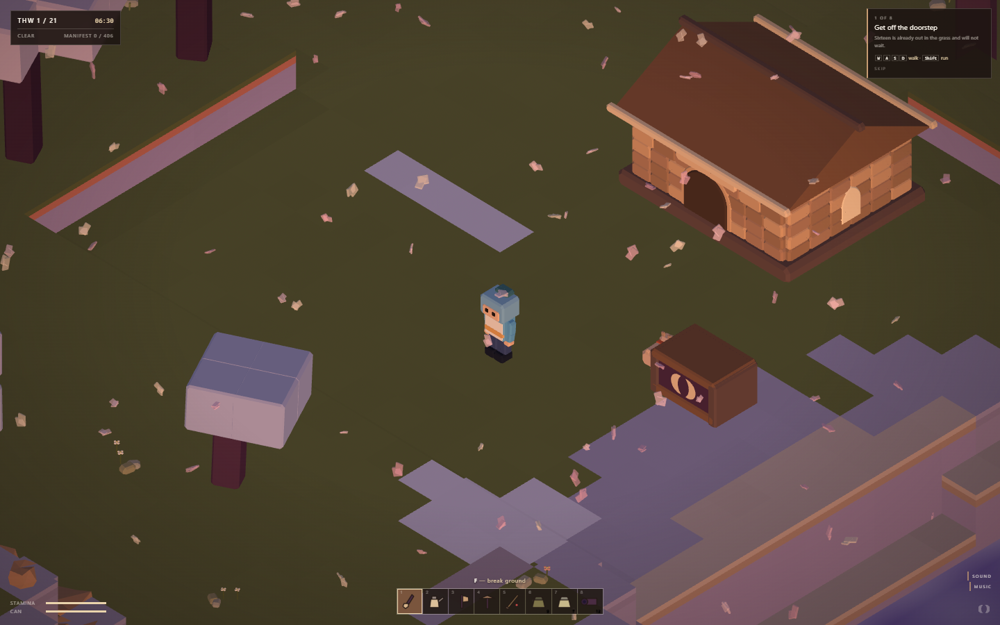
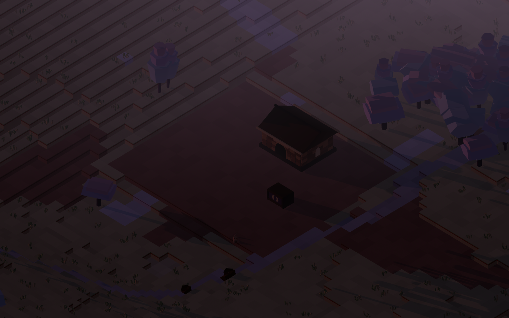
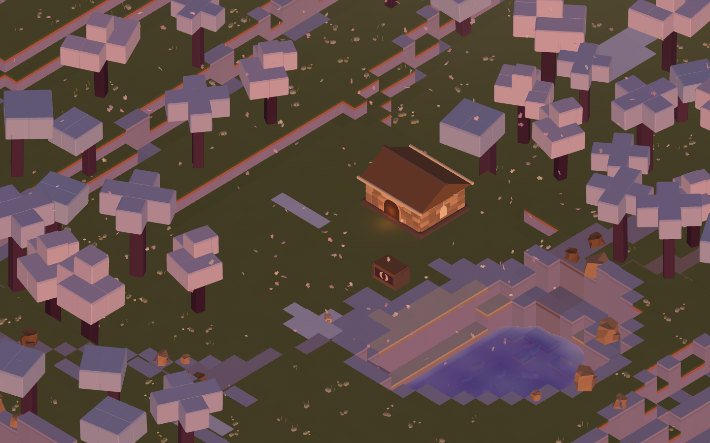

<div align="center">


# SEISMIC VALLEY

**You were the only person underground when the world was rolled back.**

A procedural survival-farming game in Three.js. Every plant, building, golem,
letterform and sound in it is generated in code — there is not one model,
texture, sprite or font file in this repository.

[Play it](https://seismic-valley.vercel.app/) · [Nxrskyaa](https://x.com/nxrskyaa)

</div>

---

<div align="center">

</div>

---

## What happened

EOF-001 was not found. It was **made** — ninety years of unmanned sowers
dropping bio-crust onto dead rock until something took. Under the valley there
is a lattice the colonists called **the Loom**, and almost nobody thought about
it, the way almost nobody thinks about plumbing. It regulated soil chemistry,
rainfall, and the length of the seasons, which is why the seasons are named
after entries in an operations calendar: **Thaw, Longlight, Rust, Still.**

The Loom keeps checkpoints. It has always kept checkpoints. Nobody read the
manual.

Forty days ago it executed a rollback to a checkpoint dated seventy-one years
earlier. It took nine seconds. Anything the checkpoint had no record of came
apart into the raw blocks the Loom builds with — houses folded down into their
components, fences unravelled into fibre, the grain silo went back to being
sand.

You were behind three metres of packed clay filing returns in the seed archive.
You wake up because a dog is standing on your chest.

In your pocket is the **Manifest Chip**: the Vault's index, listing four hundred
and six species. The Vault holds none of them. They are in the valley now, mixed
into the soil in pieces small enough that the Loom did not think them worth
deleting.

**So you plant.** Every species you carry through to a harvest writes one line
back onto the chip. That is the progress bar, and it is the whole point:
*farming here is not commerce, it is recovery.*

<div align="center">

</div>

---

## Pruning

The Loom did not finish. It rebooted into a partial state and it is **still
working the rollback**, slowly, at the pace of a machine with no deadline. Every
few nights it does a pass and takes apart whatever it finds that it has no
record of.

The first time it happens to something you built, it happens without warning,
and you wake up to a rectangle of neatly stacked components where your shed was.

That is why registration exists, and why the house tiers are not cosmetic:

| | |
|---|---|
| **A stake** | four wood and three fibre, driven at a corner. The structure is now in the record and a pass goes around it. |
| **Unregistered** | comes apart. You get most of the components back, stacked, which is somehow worse. |
| **The homestead** | never pruned. It is where you sleep. |

The cost of a stake is trivial. The cost is **remembering**.

---

## Rocky

<div align="center">

</div>

There is one other thing in the valley that walks, and it is not a person.

Rocky is a **Loom construct** — stone the lattice assembled, still standing
because unlike everything the colony built, he was *in the checkpoint*. He holds
the relay on the north ridge, he does not leave it, and he will tell you how many
nights until the next pass.

He is Seismic's mascot, and he was rebuilt here from a sheet of six reference
drawings by the [img2threejs](https://github.com/img2threejs/img2threejs)
method: reconstruction **by code**, from primitives, with no mesh anywhere in the
pipeline. What the rig holds to, read off the whole sheet rather than any one
drawing:

- a stocky four-and-a-half-head silhouette, wide chest, pinched waist
- **a brow that projects forward like a visor, with the eyes set back under it** —
  the single most identifying feature he has
- two ivory eyes that emit rather than reflect, always wider than tall
- near-black joint bands at neck, waist, shoulders, elbows and knees
- an inset chest panel carrying the mark
- a heavy drawn outline, reproduced as an inverted hull rather than faked with a
  rim term, because it is a drawing convention and not lighting

**Pebbles** are the same construct reduced until only the head is left — the
tiny one in the lotus, from the sixth drawing. They come sealed inside geodes.
Break one open and it wakes up, follows you home, and does one job at dawn.

---

## Sixteen

Her collar tag is worn down to two characters.

She is a survey dog — one of the line bred to walk ahead of the sowers and smell
whether the crust had taken — which is why she still digs things up and drops
them at your feet without being asked. She keeps a loose distance, sits when you
stop, and will not go near the south jetty.

There were forty of her.

---

## The story is found, never given

No quest-giver explains any of the above. You hoe a square of dirt and a piece
of fired clay comes up.

**Soil-tags** are Marit Flavyn's lab notebook. She was the soil chemist whose
seed lines finally made the substrate hold, she hated writing, and she used
twelve-second voice markers instead. She never came here — she died on the
transit station sixty-one years before you woke up. The colony never bothered to
collect them.

> *"Row four. The clay is too heavy here, I keep saying it, and somebody keeps
> planting row four anyway."*

That is the tone, and the first six tags are all like that. The scale is earned
by starting at ankle height. **Odenne Var**'s logs come off the relay, numbered,
and out of order — you will find log 31 before log 6, and that is correct.

Four lines on screen at once, maximum. `npm run check` fails the build if a
fragment runs longer.

---

## Two palettes, and they are not interchangeable

<div align="center">


</div>

**The world** is graded by a machine that has stopped maintaining it: nothing is
fully saturated and everything is pulled a long way toward lavender. Meadow tops
are pale khaki-olive, there is a sage hairline and a rust hairline under every
lip, and **every cliff face below that is lilac** — that one colour is most of
what makes the valley look like itself. Water is a saturated blue-violet going
pale at the shallows; canopies are lilac and blush pink on plum trunks. All of
it sampled off the reference footage rather than invented.

The day runs on a ten-key-frame table placed by eye — the horizon goes apricot at
06:00 while the zenith is still blue, noon is faintly lilac, and 19:36 has a rose
band that lasts about twenty minutes and is the best-looking part of the day. The
daytime fill light is violet **and bright**, which is the other half of why the
reference reads as pastel rather than as dusty stone.

**The interface** is Seismic's: warm stone, cream, ink, and the rose mark. It
covers the HUD, the panels, the title, and the two things in the world that
belong to Seismic rather than to the valley — Rocky, and the stone the Loom
builds with.

The rule that keeps them apart: **the interface has to be quieter than the
world.** The world is washed out; a HUD of bright rounded cards on top of it
takes the frame and the game becomes the background to a dashboard. So the HUD
is one dark plate, hairline rules, small letter-spaced caps, tabular figures, and
one accent used for one thing at a time.

`npm run check` asserts that the interface block stays in Seismic's hue band,
**and** that the world block still has its cool hues. Both directions, because
both have been broken.

---

## Running it

```bash
npm install
npm run dev
```

| | |
|---|---|
| `npm run dev` | the game, on `localhost:5173` |
| `npm run build` | a static `dist/` |
| `npm run check` | 81 assertions — the split palette, the camera, the premise, no network assets, the rig rule, the story rules, and a full headless day loop |
| `npm run lint` | eslint |
| `npm run shoot` | headless captures of every pose into `shots/` |
| `npm run mark` | regenerate `public/mark.svg` from `src/core/mark.js` |

### Controls

| | |
|---|---|
| `WASD` / arrows | walk |
| `Shift` | run |
| `Space` | jump |
| `F` / left click | use the tool in hand |
| `E` / right click | interact — harvest, talk, open the crate, go inside |
| `1`–`8` | hotbar |
| `Q` / `R` | turn the camera 90° |
| wheel | zoom |
| `Tab` | homestead — upgrade, sleep, drive stakes |
| `B` | build on the ground in front of you |
| `J` | field journal |
| `F5` | save |

On a touch device you get a virtual stick and a pad cluster, both **hit-tested
by hand** against regions drawn into their own canvas. That is not a detail: a
pad built out of `<button>` elements stops responding the moment the other thumb
is holding the stick, which is exactly when you need it.

---

## How it is built

Vanilla **Three.js** and Vite. No React: the terrain is a 96×96 integer height
grid remeshed in 16×16 chunks whenever a cell changes, and characters are eleven
boxes on pivot nodes animated by arithmetic. A reconciler adds nothing to either
and would fight the imperative chunk rebuilds.

```
src/
  core/      the split palette, the mark, the letterforms, the primitive kit,
             noise, input, audio
  world/     the height grid, generation, the chunk mesher, water, sky, props,
             crops, buildings, the orthographic camera rig
  actors/    Rocky, the pebbles, Sixteen, the settler, the cast
  game/      items, crops, state, story, pruning
  ui/        HUD, panels, icons, touch controls, the title card, one stylesheet
tools/       checks.js (self-test), shoot.mjs (headless captures), mark.mjs
```

### Five things worth knowing

**The camera is orthographic, and that is not a style choice.** With no
perspective divergence the terraces line up into clean stacked slabs, and that
stacking is the entire silhouette language of this world. The yaws are
45/135/225/315, not 0/90/180/270 — on a square grid the diagonal yaws put the
cell edges at 45° to the screen; the axis-aligned ones flatten every cliff into a
horizontal band and the depth cue goes with it.

**A height level is one world unit, and there are no cast shadows.** Both were
measured off the reference rather than chosen: a single terrace step there is a
wall about as tall as a cell is wide, and there is not one cast shadow anywhere
in eighty seconds of footage. At half a unit every riser is a kerb and the map
flattens into a pattern; add a directional shadow and it immediately reads as a
heavier, more realistic game than this one is.

**Trees are a slab, not a cone.** A thin rectangular plum trunk carrying a flat
cluster of large cubes three to five cells across. They are the only vertical
thing in a world of flat plateaus, so their silhouette sets the whole read — an
earlier pass built them as stacked prisms narrowing to a point, and that one
shape was doing as much damage as the palette was.

**Terraces are built into the height field, not found by filtering it.** Rounding
a smooth field to levels gives a smooth *staircase* — every cell one level off
its neighbour, all the way down every slope — and no amount of blurring or
median-filtering fixes it, because the median of a ramp is the ramp. So the field
is pushed into flat bands before it is quantised, and the interior gradient is
kept gentle enough that a band is about ten cells wide. Measured, not eyeballed:
mean plateau run went 3.1 → 9.3 cells across that change.

**Winding matters.** Three.js treats counter-clockwise-from-the-front as the
front face. Get a chunk's quads backwards and you do not see a culling bug, you
see "the lighting is broken" — because what you are looking at is the inside of
the world.

**Scale is applied before rotation.** Three composes `T * R * S`, so a prism
whose axis is Z takes its length from `scale.z` no matter how it is rotated
afterwards. Rotate one upright, pass it `[width, length, depth]`, and the length
silently lands in `depth`. The kit ships prisms in both orientations and nothing
in a rig is ever given a rotation; `npm run check` fails the build if one appears.

**The shadow frustum has to track the zoom.** Anything outside it samples the
shadow map's border texel and comes back *fully shadowed*. Size it to the
player's immediate surroundings and a wide zoom paints the entire valley solid
black — which does not look like a shadow bug, it looks like the lights are off,
and there is no error anywhere.

### Nothing loads over the network at runtime

No CDN font, no `.glb`, no remote texture, no audio file. The typeface is drawn
from contours in `src/core/wordmark.js`; the item icons are canvas paths; every
sound is a few oscillators and one shared noise buffer. `npm run check` greps
`src/` for `fetch`, `XMLHttpRequest`, any Three.js loader, any http URL and any
binary asset, and fails if it finds one.

---

## Where this came from

Seismic Valley is a ground-up rebuild of [Velion](https://github.com/nxrskyaa/Velion),
a Godot 4 prototype of the same game, in Three.js. The setting, the palette, the
camera, the premise and the Pruning mechanic are Velion's and are carried across
deliberately. What is new here is the engine, the interface, and Rocky.

It shares a mascot with [Seismic Skate](https://github.com/nxrskyaa/Seismic-Skate),
which is the same construct on a turbine skateboard.

---

<div align="center">

<br /><br />
<sub>Built by <a href="https://x.com/nxrskyaa">Nxrskyaa</a>.</sub>
</div>
