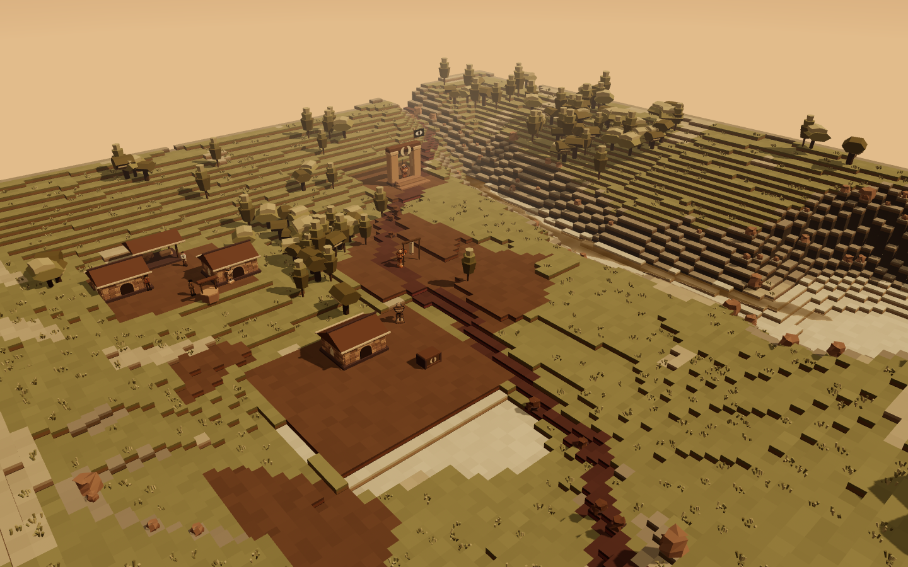
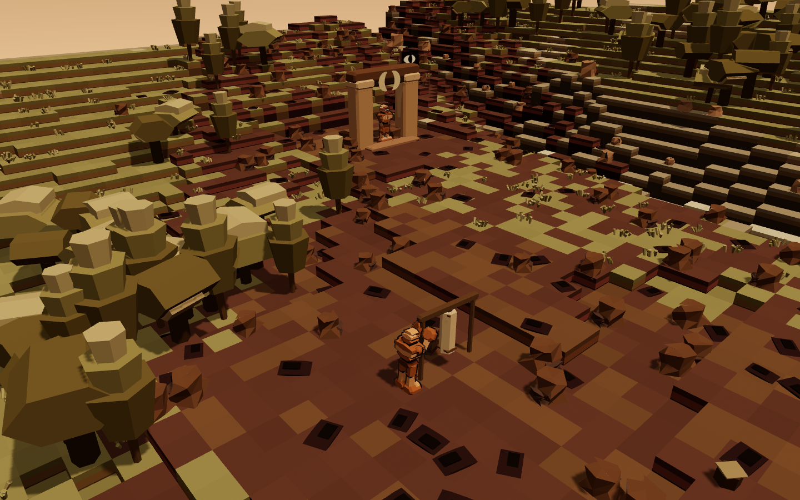
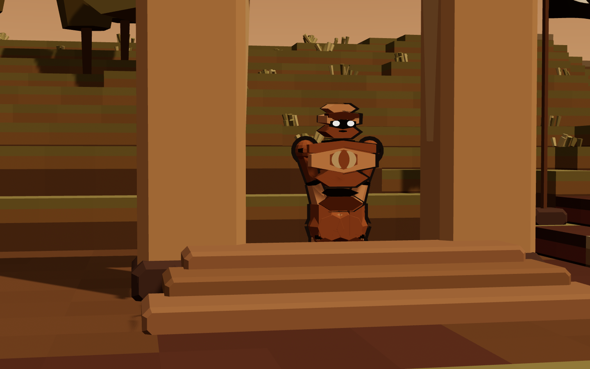
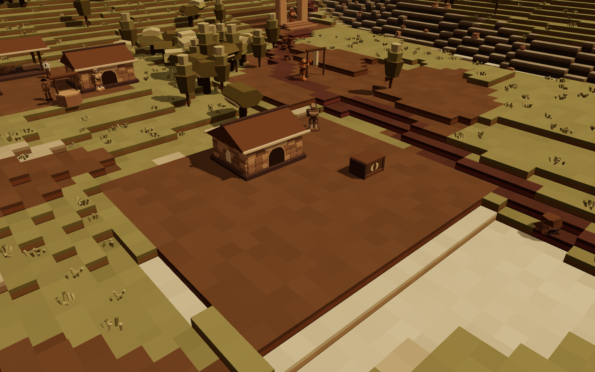
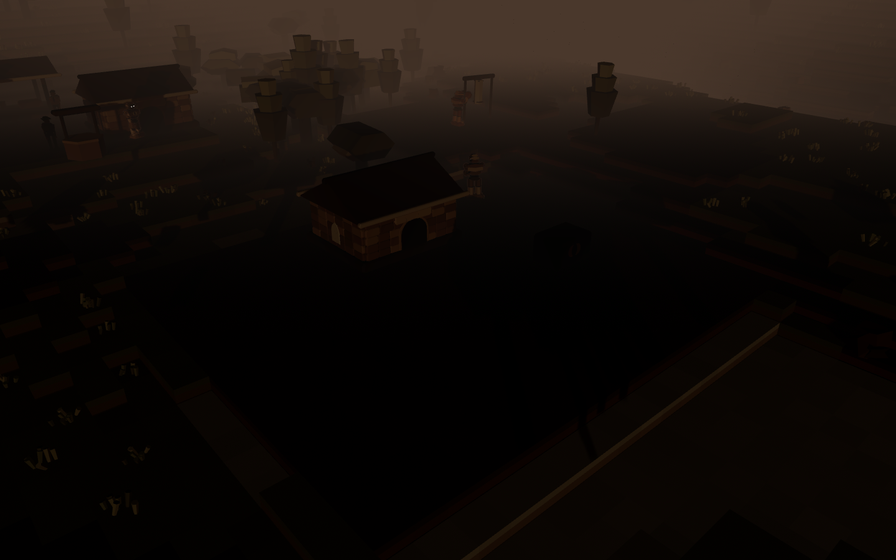

<div align="center">


# SEISMIC VALLEY

**Farm a valley that will not hold still.**

A procedural farming game in Three.js. Every plant, building, golem, letterform
and sound in it is generated in code — there is not one model, texture, sprite
or font file in this repository.

[Play it](https://seismic-valley.vercel.app/) · [Nxrskyaa](https://x.com/nxrskyaa) · themed on [Seismic](https://seismic.systems)

</div>

---

<div align="center">

</div>

---

## What it is

You have a plot, a hoe, a watering can, and a fault line running diagonally
through the middle of the valley.

Every few days the fault moves. A band of ground along it lifts or drops a
level, scars over, cracks open, and pushes geodes up out of the dirt. Anything
you planted in that band is gone.

Unless it was standing behind a **cairn**.

That is the whole game, and it is deliberately one idea rather than twelve:

| | |
|---|---|
| **Near the fault** | the best soil, the geodes, the shards — and a tremor every four to seven days |
| **Far from the fault** | perfectly safe, and perfectly poor |
| **A cairn** | holds its own patch of ground steady, and doubles the growth rate inside it |

So the game is a long negotiation with the ground. You quarry stone, square it
at the kiln, raise a cairn, and push your fields a little closer to the scar.
Then the fault gets stronger, and you do it again.

<div align="center">

<br /><sub>Four seconds after the fault moved. The dark rectangles are fissures; the lumps along them are geodes.</sub>
</div>

---

## Rocky

Seismic's mascot is a stone golem, and he is the reason this valley has people
in it at all.

He was rebuilt here from a sheet of six reference drawings using the
[img2threejs](https://github.com/img2threejs/img2threejs) method —
reconstruction **by code**, from primitives, with no mesh anywhere in the
pipeline. Read as a set rather than one at a time, the drawings agree on a small
number of things, and those things are what the rig holds to:

- a stocky four-and-a-half-head silhouette with a wide chest and a pinched waist
- **a brow that projects forward like a visor, with the eyes set back under it** —
  the single most identifying feature he has
- two ivory eyes that emit rather than reflect, always wider than tall
- near-black joint bands at neck, waist, shoulders, elbows and knees
- an inset chest panel carrying the brand — and **both** versions in the
  reference are canon, so `chest` is a parameter: the incised double-crescent
  mark, or the rose shard set into a recess
- a heavy drawn outline, reproduced as an inverted hull rather than faked with a
  rim term, because it is a drawing convention and not lighting

Rather than pick one drawing and discard the rest, each became a member of his
family with a job in the valley — same rig, different cut, different chest mark,
different idle:

| | | |
|---|---|---|
| **Rocky** | Keeper of the Ridge Gate | tells you how many days until the fault moves |
| **Cairn** | his sister | teaches you to raise stones, and what they hold |
| **Flint** | works the bag at the yard | counting, all day, every day |
| **Bloom** | carries flowers | to people who did not ask for them |

<div align="center">

</div>

### Pebbles

The sixth drawing is a tiny one: a rounded stone in a lotus, two sparkles for
eyes, one small smile. That is a **pebble** — Rocky reduced until only the head
is left, which is exactly what makes it read as his young rather than as a
different creature. It is built from Rocky's own head numbers, scaled, with the
brow kept and everything below the collar thrown away.

They hatch out of geodes, follow you home, sleep where they stand at night, and
each does one job at dawn:

- **Waterer** — waters four tiles
- **Harvester** — lifts one ripe crop
- **Forager** — brings back whatever the valley dropped
- **Surveyor** — reads the fault three days out instead of one

---

## The architecture

Every door, window and gate in the valley is the same shape: **the lune arch**.

Seismic's mark is two crescents pinched at a narrow waist, and the negative
space between them — a tall opening that comes to a point — is a doorway. So the
buildings belong to the mark without ever having the mark stamped on them.

<div align="center">

</div>

The kit: homestead (four tiers), Ridge Gate, kiln, quarry shed, vault, well,
shipping crate, and the cairn itself.

---

## One colourway

Seismic is brown stone and cream paper, and this game holds to it everywhere —
world, characters, buildings and interface. There is no second palette and no
"just this one accent" escape hatch, because **a farming game is a colour-sorting
game**: the moment a crop is allowed to be blue so you can tell it from a green
one, the valley stops being a quarry and starts being a fruit bowl.

So every colour lives in one narrow band of hue — roughly 352° through 64°,
rust to ochre — and things separate by **value** and by **silhouette** instead.
The single exception is the rose shard, and it is not an exception at all: it is
Seismic's own mark, and it appears only where that mark appears.

`npm run check` parses `src/core/palette.js` and fails the build if any colour in
it falls outside the band. The rule is enforced, not remembered.

---

## Running it

```bash
npm install
npm run dev
```

| | |
|---|---|
| `npm run dev` | the game, on `localhost:5173` |
| `npm run build` | a static `dist/` |
| `npm run check` | 58 assertions — the colourway, the rig rule, the whole day loop, save round-trip, and the mark's geometry |
| `npm run lint` | eslint |
| `npm run shoot` | headless captures of every pose into `shots/` |
| `npm run mark` | regenerate `public/mark.svg` from `src/core/mark.js` |

### Controls

| | |
|---|---|
| `WASD` / arrows | walk |
| `Shift` | run |
| `Space` | jump |
| `F` / left click | use the tool in hand |
| `E` / right click | interact — harvest, talk, open the crate, go inside |
| `1`–`8` | hotbar |
| `Q` / `R` | turn the camera 90° |
| wheel | zoom |
| `Tab` | homestead — upgrade, sleep, fill requests |
| `B` | raise a cairn or a building on the ground in front of you |
| `J` | field journal |
| `F5` | save |

On a touch device the left half of the screen is a thumbstick and the right half
acts. The split is by screen half rather than by a drawn control, so it works at
any aspect without a layout pass.

---

## How it is built

Vanilla **Three.js** and Vite. No React here, on purpose: the terrain is a
96×96 integer height grid remeshed in 16×16 chunks whenever a cell changes, and
characters are eleven boxes on pivot nodes animated by arithmetic. A reconciler
adds nothing to either and would fight the imperative chunk rebuilds.

```
src/
  core/      palette, the mark, the letterforms, the primitive kit, noise, input, audio
  world/     the height grid, generation, the chunk mesher, water, sky, props, crops,
             buildings, the camera rig
  actors/    Rocky, the pebbles, the settler, the cast
  game/      items, crops, state, the tremor
  ui/        HUD, panels, icons, the title card, one stylesheet
tools/       checks.js (self-test), shoot.mjs (headless captures), mark.mjs
```

### Four things worth knowing

**The terrain is quantised once, at the very end.** Heights are built as floats,
blurred, and only then rounded to integer levels. Blurring integer levels only
ever produces more integer levels; blurring the float field is what turns a
fizzing surface into terraces you can actually plant on.

**Winding matters.** Three.js treats counter-clockwise-from-the-front as the
front face. Get a chunk's quads backwards and you do not see a culling bug, you
see "the lighting is broken" — because what you are looking at is the inside of
the world.

**Scale is applied before rotation.** Three composes `T * R * S`, so a prism
whose axis is Z takes its length from `scale.z` no matter how it is rotated
afterwards. Rotate one upright, pass it `[width, length, depth]`, and the length
silently lands in `depth` — a squat puck where you asked for a limb, with no
error anywhere. The kit therefore ships prisms in both orientations and nothing
in a rig is ever given a rotation. `npm run check` fails the build if one
appears.

**The shadow frustum is easy to get wrong in the tight direction.** Anything
outside it samples the shadow map's border texel and comes back shadowed, so a
frustum sized to the player's immediate surroundings paints the entire far half
of the valley black.

### Nothing loads over the network at runtime

No CDN font, no `.glb`, no remote texture, no audio file. The typeface is drawn
from contours in `src/core/wordmark.js`; the item icons are canvas paths; every
sound is a few oscillators and one shared noise buffer. `npm run check` greps
`src/` for `fetch`, `XMLHttpRequest`, any Three.js loader, any http URL and any
binary asset, and fails if it finds one.

---

## Where this came from

Seismic Valley is a ground-up rebuild of an earlier Godot prototype of mine,
Velion, in Three.js — new engine, new art direction, new mascot, and a new
central mechanic. The farming loop is the part that survived; the tremor, the
cairns, the pebbles, the golem cast and the entire visual language are new here.

It shares a world with [Seismic
Skate](https://github.com/nxrskyaa/Seismic-Skate), which is the same mascot on a
turbine skateboard.

---

<div align="center">

<br /><br />
<sub>Built by <a href="https://x.com/nxrskyaa">Nxrskyaa</a>.</sub>
</div>
